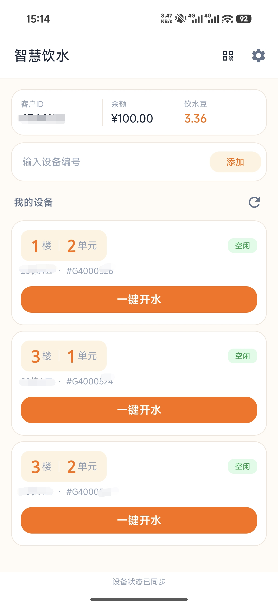
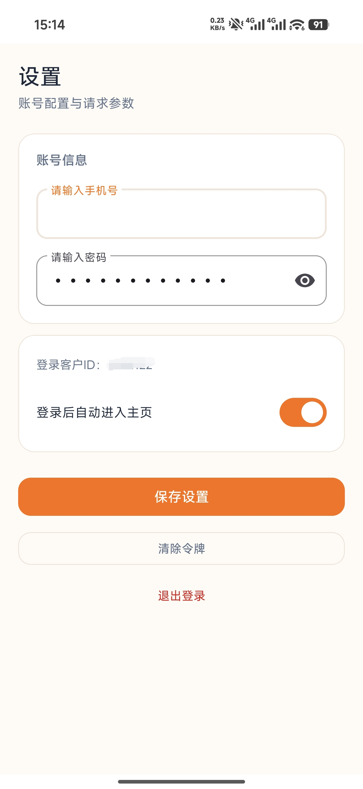

# Water Free｜极简用水助手

基于 Kotlin 的非官方 Android 用水客户端，省去复杂的步骤一键开水。

## 简要介绍

日常使用校园热水设备时，需要经历打开app，弹出广告，点击热水栏目，点击设备，再点击开水，特别繁琐，有时还会面临登录失效重新登录的局面。
于是就想做一个简洁的app，打开app进入主页无感登录（设置了账号密码后）、在主页就显示所有设备，并可以直接点击开水。
先对官方app抓包除关键请求，用 Python 验证接口流程，再以 Kotlin + Material Components 做一个现代化app；
实现从登录、添加设备到一键启动用水的完整客户端流程，支持设备状态刷新、滑动删除与撤销；最后在主要功能上与官方app一致，且操作上简单许多。

## 实机截图

| 主页 | 设置页 |
| :---: | :---: |
|  |  |
| 主页可以直接开启热水以及添加设备、删除设备。 | 管理账号配置、自动进入主页选项，以及清除令牌和退出登录。 |

## 项目结构

```text
android-app/   Android 主应用
app/           Python Tkinter 桌面原型
tools/         Python 命令行调试工具
docs/          云端构建说明与实机截图
.github/       GitHub Actions 工作流
build.ps1      Windows 构建脚本
```

## 使用与安全

- 仅用于本人账号及获授权设备，遵守服务方规则；项目名称不代表免费用水或免除正常计费。
- 依赖第三方服务，接口兼容性与可用性不作保证。
